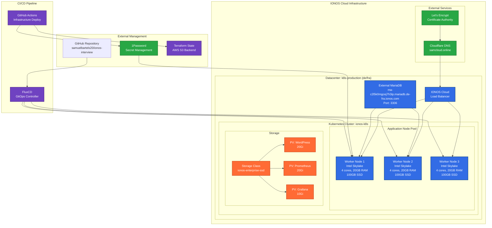
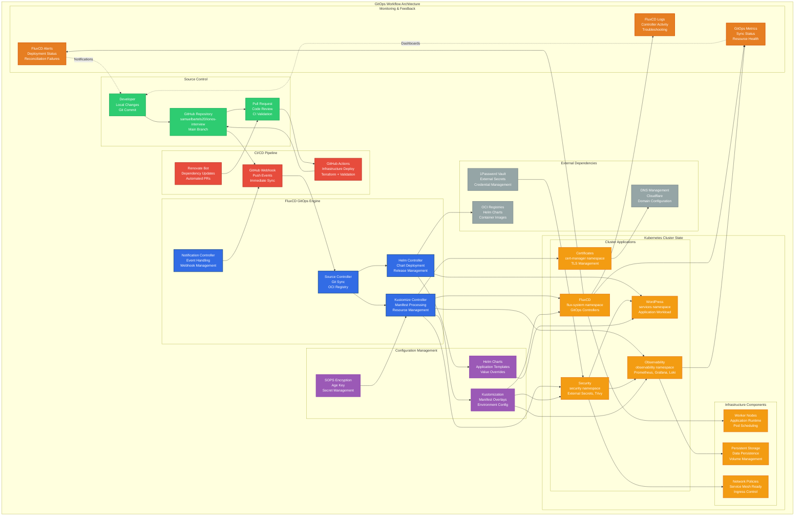
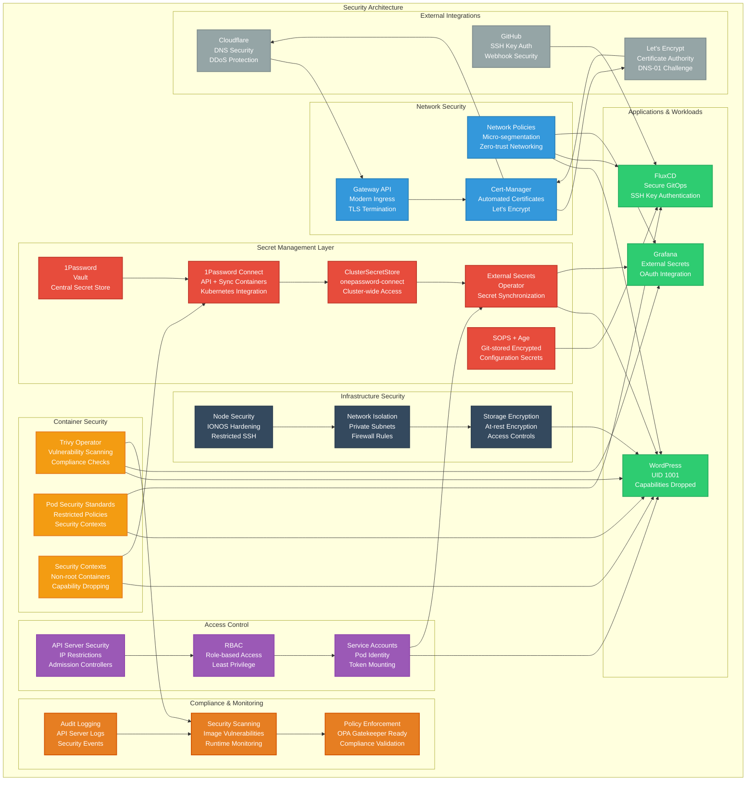
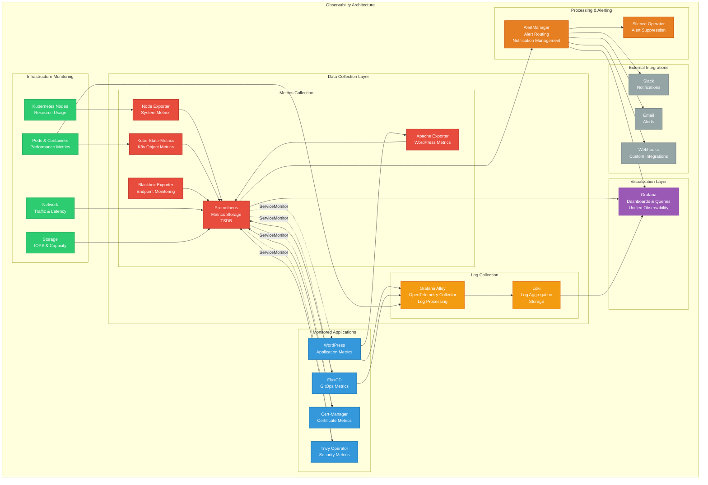
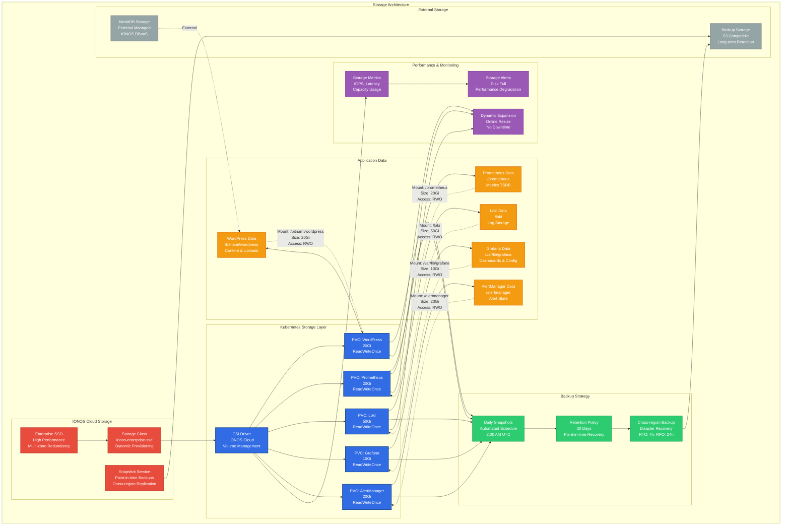

# IONOS Kubernetes Platform Architecture

## Overview

This repository implements a production-ready Kubernetes platform on IONOS Cloud using GitOps principles with FluxCD. The architecture follows cloud-native best practices with comprehensive observability, security, and automation.

## 🏗️ Infrastructure Architecture

### Overall Infrastructure Diagram

The following diagram shows the complete infrastructure architecture including IONOS Cloud components, external services, and CI/CD pipeline:



### Cloud Infrastructure (Terraform)

The platform is built on IONOS Cloud infrastructure using Terraform for Infrastructure as Code (IaC):

**Location**: Frankfurt, Germany (`de/fra`)
**Cluster**: `ionos-k8s` running Kubernetes v1.32.6

#### Core Components:

1. **Datacenter**: `k8s-production` in Frankfurt
2. **Kubernetes Cluster**: Managed IONOS Kubernetes Service
3. **Node Pool**: 3 worker nodes (Intel Skylake, 4 cores, 20GB RAM, 100GB SSD)
4. **External Database**: MariaDB managed service
5. **Load Balancer**: IONOS Cloud Load Balancer
6. **Storage**: IONOS Enterprise SSD storage class

#### Network Configuration:
- **API Access**: Restricted to specific IP (`154.161.97.168/32`)
- **Public Cluster**: Internet-accessible with security controls
- **Maintenance Window**: Sundays 10:00 UTC

### Terraform Providers:
- **IONOS Cloud**: Primary infrastructure provider
- **Kubernetes/Helm**: Application deployment
- **1Password**: Secret management
- **AWS**: Additional services (S3 backend)
- **TLS/Local**: Certificate and file management

## 🔄 GitOps Architecture (FluxCD)

### GitOps Workflow Diagram

This diagram illustrates the complete GitOps workflow from development to deployment:



### FluxCD Components

The platform uses FluxCD v2.6.4 for GitOps continuous deployment:

#### Core Controllers:
- **Source Controller**: Git repository and OCI registry management
- **Kustomize Controller**: Kubernetes manifest processing
- **Helm Controller**: Helm chart deployment
- **Notification Controller**: Event notifications and webhooks

#### GitOps Flow:
1. **Git Repository**: `ssh://git@github.com/samuelbartels20/ionos-interview.git`
2. **Branch**: `main` 
3. **Path**: `kubernetes/flux/cluster`
4. **Sync Interval**: 1 hour
5. **Webhook**: GitHub webhook for immediate sync

### Repository Structure:

```
├── infrastructure/          # Terraform IaC
├── kubernetes/
│   ├── apps/               # Application deployments
│   │   ├── cert-manager/   # Certificate management
│   │   ├── flux-system/    # FluxCD components
│   │   ├── kube-system/    # System components
│   │   ├── observability/  # Monitoring stack
│   │   ├── security/       # Security tools
│   │   └── services/       # Application services
│   ├── components/         # Shared components
│   │   └── common/         # Common resources
│   └── flux/              # FluxCD configuration
├── bootstrap/             # Initial setup
└── wordpress/            # WordPress Helm chart
```

## 🔐 Security Architecture

### Security Architecture Diagram

This comprehensive diagram shows all security layers and how they interact:



### Multi-Layer Security Approach

#### 1. Secret Management
- **1Password Connect**: Centralized secret management
- **External Secrets Operator**: Kubernetes secret synchronization
- **SOPS + Age**: Git-stored encrypted secrets
- **Cluster Secret Store**: Secure secret distribution

#### 2. Container Security
- **Trivy Operator**: Vulnerability scanning and compliance
- **Pod Security Standards**: Enforced security contexts
- **Non-root containers**: All workloads run as non-root
- **Capability dropping**: Minimal container privileges
- **Read-only filesystems**: Where applicable

#### 3. Network Security
- **Network Policies**: Micro-segmentation between namespaces
- **Gateway API**: Modern ingress with security controls
- **TLS Everywhere**: End-to-end encryption
- **Cert-Manager**: Automated certificate lifecycle

#### 4. Access Control
- **RBAC**: Role-based access control
- **Service Accounts**: Least privilege principle
- **API Server Security**: Restricted access by IP
- **Admission Controllers**: Policy enforcement

### Certificate Management

**Cert-Manager** with Let's Encrypt integration:
- **DNS-01 Challenge**: Cloudflare DNS validation
- **Automated Renewal**: 90-day certificate lifecycle
- **ClusterIssuer**: Production Let's Encrypt issuer
- **Wildcard Certificates**: `*.samcloud.online`

##  Observability Architecture

### Observability Stack Diagram

This diagram shows the complete observability architecture with data flow and integrations:



### Monitoring Stack (Prometheus Ecosystem)

#### Core Components:

1. **Kube-Prometheus-Stack**
   - **Prometheus**: Metrics collection and storage
   - **Alertmanager**: Alert routing and management
   - **Grafana**: Visualization and dashboards
   - **Node Exporter**: System metrics
   - **Kube-State-Metrics**: Kubernetes object metrics

2. **Grafana Alloy** (OpenTelemetry Collector)
   - **Log Collection**: Pod and container logs
   - **Metrics Processing**: Prometheus metrics pipeline
   - **Trace Collection**: Distributed tracing

3. **Loki** (Log Aggregation)
   - **Log Storage**: Efficient log storage
   - **LogQL**: Powerful query language
   - **Retention**: Configurable log retention
   - **Grafana Integration**: Unified observability

4. **Additional Exporters**
   - **Blackbox Exporter**: Endpoint monitoring
   - **Apache Exporter**: Web server metrics
   - **Custom ScrapeConfigs**: External service monitoring

#### Monitoring Targets:
- **Infrastructure**: Nodes, pods, containers
- **Applications**: WordPress, databases, services
- **Network**: Ingress, services, endpoints
- **Security**: Trivy scan results, cert status
- **External**: PiKVM, ZigBee controller, 1Password

### Alerting Strategy

**AlertManager Configuration**:
- **Route**: `alertmanager.samcloud.online`
- **Storage**: 20Gi persistent volume
- **Integration**: External notification systems
- **Silence Operator**: Automated alert suppression

### Log Management

**Centralized Logging Pipeline**:
```
Pod Logs → Alloy → Loki → Grafana
```

**Log Processing**:
- **Structured Logging**: JSON format preferred
- **Label Enrichment**: Namespace, pod, container metadata
- **Filtering**: Noise reduction and sampling
- **Retention**: Configurable per namespace

## 🗄️ Storage Architecture

### Storage Architecture Diagram

This diagram illustrates the complete storage architecture including provisioning, backup, and monitoring:



### Storage Classes

**Primary**: `ionos-enterprise-ssd`
- **Type**: IONOS Enterprise SSD
- **Performance**: High IOPS, low latency
- **Availability**: Multi-zone redundancy
- **Backup**: Snapshot-based backup

### Persistent Volume Strategy

#### Application Storage:
- **WordPress**: 20Gi for content and uploads
- **Prometheus**: 20Gi for metrics storage
- **Loki**: Configurable log retention
- **Grafana**: Configuration and dashboard storage

#### Backup Strategy:
- **Automated Snapshots**: Daily backups
- **Retention**: 30-day retention policy
- **Cross-region**: Disaster recovery ready
- **Application-aware**: Database consistency


## 🚀 Application Architecture

### WordPress Deployment

**High Availability WordPress**:
- **Replicas**: 2 pods with anti-affinity
- **Node Distribution**: Required separate node placement
- **Database**: External MariaDB managed service
- **Storage**: 20Gi persistent volume
- **Caching**: Redis integration ready
- **Monitoring**: Prometheus ServiceMonitor

#### WordPress Security:
- **Non-root**: UID 1001 execution
- **Capabilities**: All dropped
- **Network Policy**: Restricted communication
- **Secrets**: External secret management
- **Updates**: Controlled via GitOps

### System Components

#### Kube-System Namespace:
- **Metrics Server**: Resource usage metrics
- **Reloader**: Automatic pod restart on config changes
- **Spegel**: Container image caching

#### Flux-System Namespace:
- **FluxCD Controllers**: GitOps automation
- **Webhook Receiver**: GitHub integration
- **Source Repositories**: Chart and manifest sources

## 🔧 Operational Architecture

### Automation and CI/CD

#### GitHub Actions:
- **Infrastructure**: Terraform plan/apply
- **Secret Management**: 1Password integration
- **Security Scanning**: Trivy and tfsec
- **Validation**: Terraform and YAML linting

#### FluxCD Automation:
- **Continuous Deployment**: Git-to-cluster sync
- **Drift Detection**: Configuration compliance
- **Rollback**: Automatic failure recovery
- **Multi-tenancy**: Namespace isolation

### Maintenance and Updates

#### Automated Updates:
- **Renovate**: Dependency updates
- **Image Updates**: Container image automation
- **Helm Charts**: Version management
- **Kubernetes**: Cluster version updates

#### Maintenance Windows:
- **Cluster**: Sundays 10:00 UTC
- **Database**: Sundays 09:00 UTC
- **Applications**: Rolling updates
- **Certificates**: Automatic renewal

### Disaster Recovery

#### Backup Strategy:
- **Infrastructure**: Terraform state backup
- **Applications**: Persistent volume snapshots
- **Secrets**: 1Password vault backup
- **Configuration**: Git repository backup

#### Recovery Procedures:
- **RTO**: 4 hours (Recovery Time Objective)
- **RPO**: 24 hours (Recovery Point Objective)
- **Runbooks**: Documented procedures
- **Testing**: Regular DR drills

## Scalability and Performance

### Horizontal Scaling

#### Application Scaling:
- **HPA**: Horizontal Pod Autoscaler ready
- **VPA**: Vertical Pod Autoscaler capable
- **Node Scaling**: Manual node pool scaling
- **Storage**: Dynamic volume expansion

#### Performance Optimization:
- **Resource Limits**: Proper resource allocation
- **Caching**: Redis and CDN integration
- **Database**: Connection pooling
- **Images**: Multi-stage builds and caching

### Monitoring and Alerting

#### Key Metrics:
- **Resource Utilization**: CPU, memory, storage
- **Application Performance**: Response time, error rate
- **Infrastructure Health**: Node status, network
- **Security Events**: Vulnerability alerts, access logs

#### Alert Thresholds:
- **Critical**: Service down, security breach
- **Warning**: High resource usage, certificate expiry
- **Info**: Deployment status, backup completion

##  Troubleshooting and Debugging

### Observability Tools

#### Log Analysis:
```bash
# View application logs
kubectl logs -f deployment/wordpress -n services

# Query logs in Loki
{namespace="services",app="wordpress"} |= "error"
```

#### Metrics Queries:
```promql
# WordPress response time
http_request_duration_seconds{job="wordpress"}

# Pod resource usage
container_memory_usage_bytes{pod=~"wordpress-.*"}
```

#### Health Checks:
- **Liveness Probes**: Application health
- **Readiness Probes**: Traffic readiness
- **Startup Probes**: Slow-starting applications

### Common Issues and Solutions

#### Pod Scheduling:
- **Anti-affinity**: Ensure sufficient nodes
- **Resource Constraints**: Check node capacity
- **Taints/Tolerations**: Node scheduling rules

#### Storage Issues:
- **PVC Binding**: Storage class availability
- **Volume Expansion**: Dynamic resize support
- **Backup Restoration**: Snapshot recovery

#### Network Problems:
- **DNS Resolution**: CoreDNS configuration
- **Service Discovery**: Endpoint availability
- **Ingress**: Gateway and route configuration

### Security Monitoring

#### Threat Detection:
- **Trivy Scans**: Vulnerability assessment
- **Falco**: Runtime security monitoring
- **Audit Logs**: API server activity

